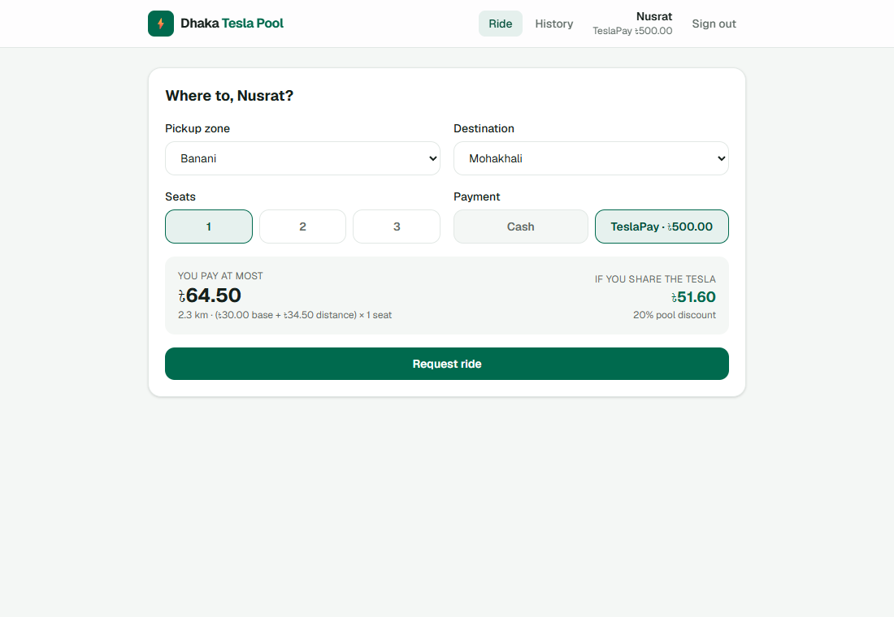
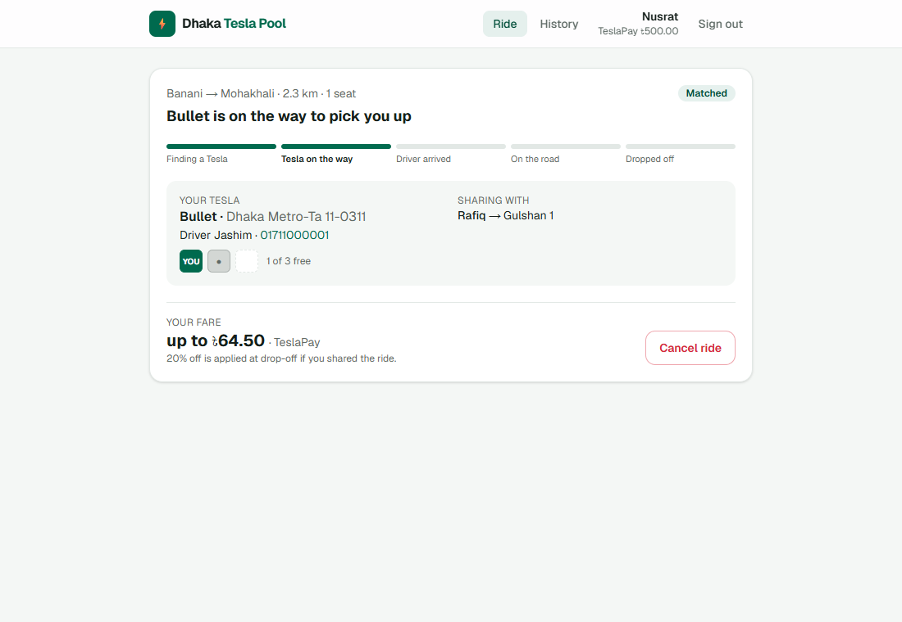
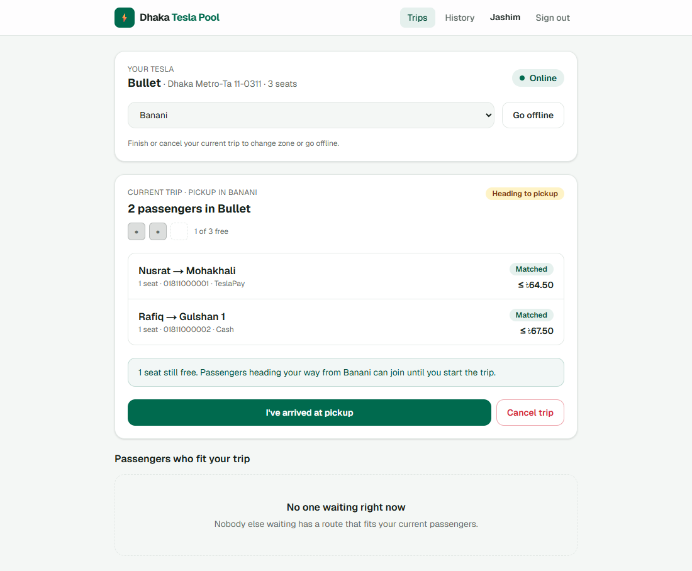
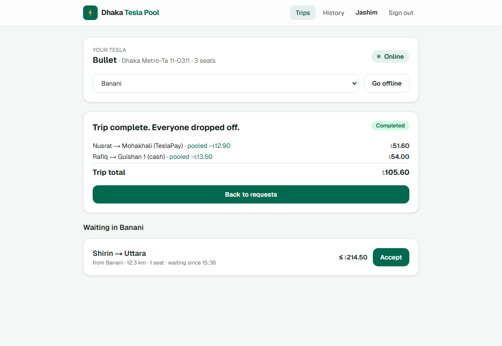
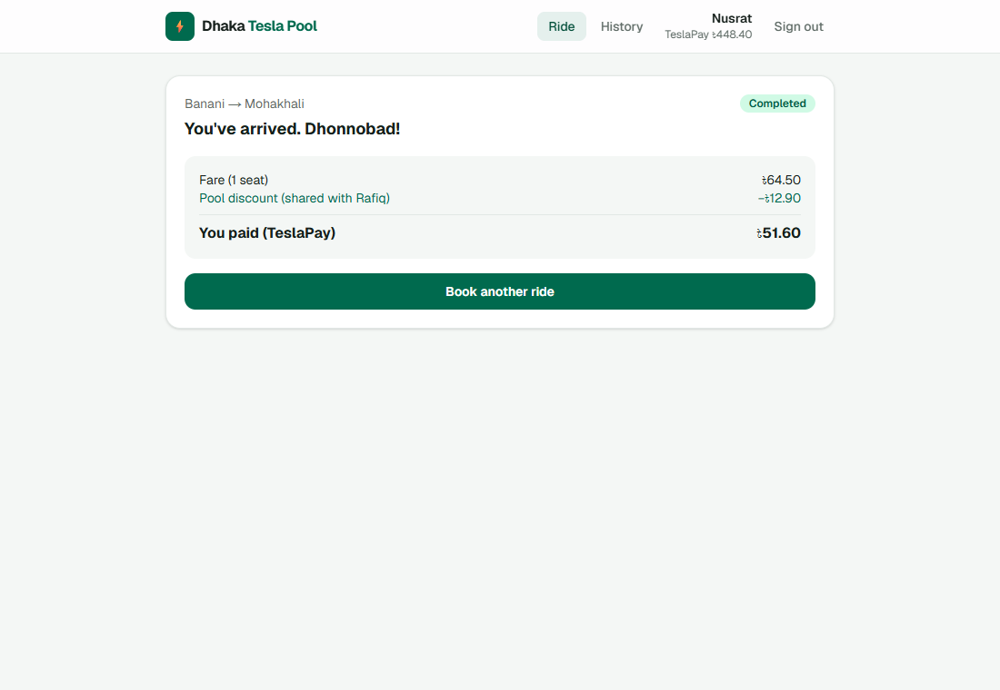
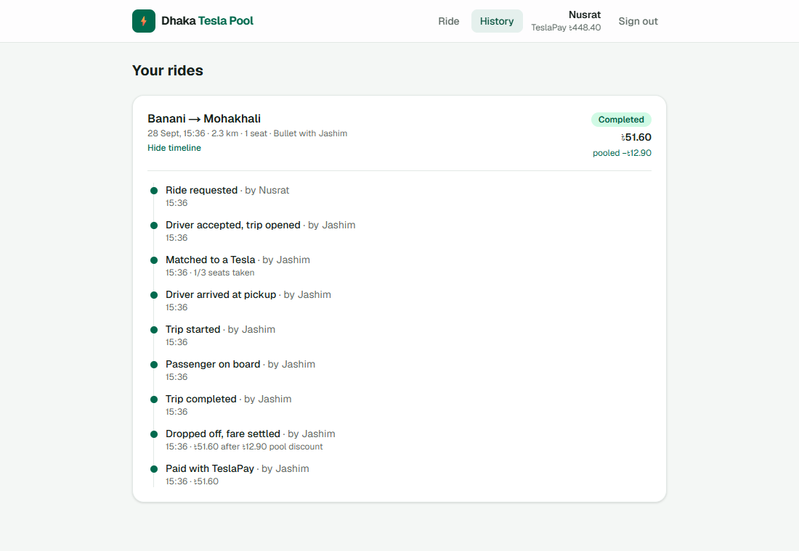
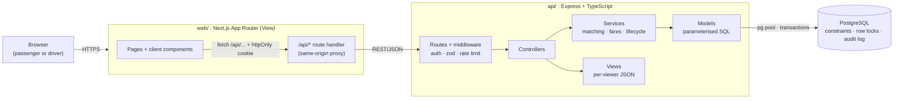
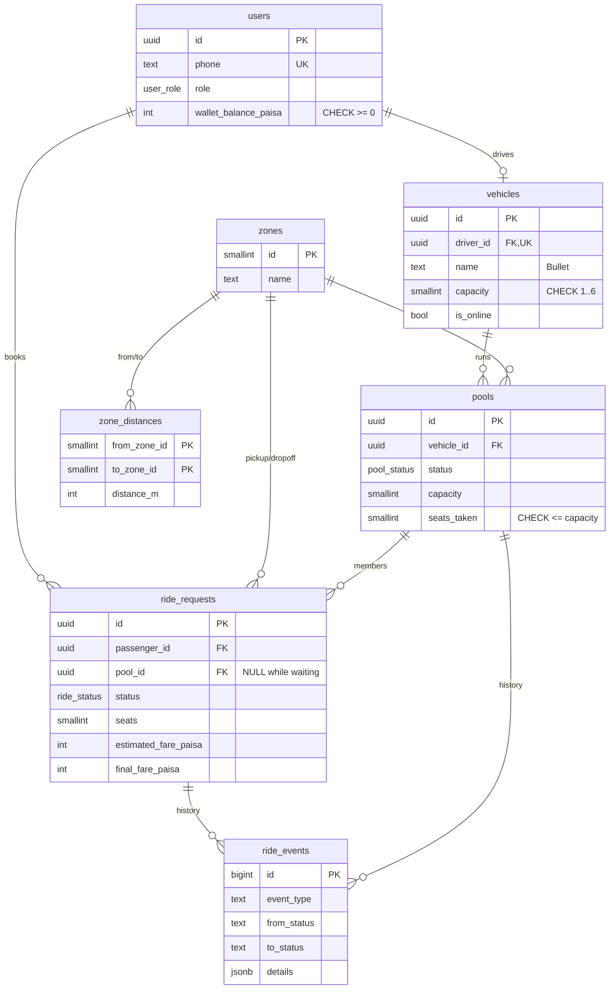
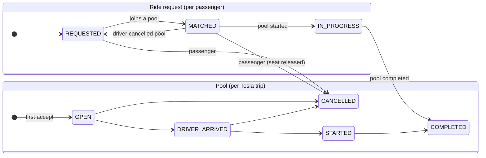
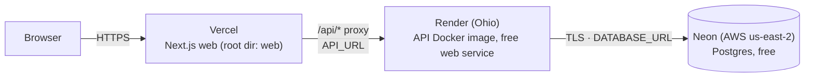

# Dhaka Tesla Pool

> Share a seat. Split the fare. Survive Dhaka traffic.

[](https://github.com/Ezazulmahi/dhaka-tesla-pool/actions/workflows/ci.yml)

<!-- TODO(owner): replace the video placeholder below before submitting. -->
**🎥 Demo video (6 min):** _link to be added_
**🌐 Live demo:** **https://dhaka-tesla-pool-theta.vercel.app** (demo logins below, password `bullet123`).
The API runs on Render's free tier and sleeps when idle, so the first request after a
quiet spell takes about a minute.

8:41 AM, Banani Road 11. Nusrat books a ride to Mohakhali. Two minutes later Rafiq books
Banani → Gulshan 1. Their routes overlap, so they share Jashim's three-seat Tesla,
**Bullet**, and each pays their own discounted fare. Then Shirin tries to grab the last
seat at the same moment as someone else, and exactly one of them gets it.

This repository is the MVP for that story: a Next.js frontend, a Node.js (Express) API and
PostgreSQL, all running with `docker compose up`.

---

## Contents

1. [Problem and approach](#problem-and-approach)
2. [Features](#features)
3. [Screenshots](#screenshots)
4. [Architecture](#architecture) · [ERD](#database-erd) · [Lifecycles](#ride-and-pool-lifecycles)
5. [Matching rule](#matching-rule) · [Fare model](#fare-model) · [Concurrency](#concurrency-the-last-seat)
6. [Tech stack and why](#tech-stack-and-why)
7. [Project structure](#project-structure)
8. [Getting started](#getting-started) (Docker, local, tests, demo accounts)
9. [API overview](#api-overview)
10. [Deployment](#deployment)
11. [Assumptions](#assumptions) · [Trade-offs](#key-decisions-and-trade-offs) · [Limitations](#known-limitations) · [Next steps](#next-improvements)
12. [Scaling bonus](#bonus-if-oi-tesla-goes-viral)
13. [Git workflow](#git-workflow)
14. [AI usage](#ai-usage)

---

## Problem and approach

**Who uses it**
- **Passengers** (Nusrat, Rafiq, Shirin) want to get somewhere, see the price up front,
  and pay less when they share.
- **Drivers** (Jashim with Bullet, Kamal with Toofan) want to know who's riding, how many
  seats are taken, and what to do next.

**The core problem** is seat allocation under concurrency. Several independent bookings
compete for a fixed number of seats in one vehicle. That has to stay correct when two
people press "Request" at the same instant, and every change must stay explainable
afterwards.

**The approach, in one paragraph.** A passenger's **ride request** joins a Tesla's
**pool**. That happens automatically if a compatible pool is already open in their pickup
zone; otherwise a driver accepts them. Seats are claimed inside a Postgres transaction that
locks the pool row, and a `CHECK (seats_taken <= capacity)` constraint makes overbooking
impossible even if the code were wrong. Each passenger's fare is computed individually in
integer paisa and finalised when the trip ends. Every state change is appended to an audit
log (`ride_events`).

## Features

**Passenger (Nusrat, Rafiq, Shirin)**
- Sign up / sign in (phone number + password; httpOnly session cookie)
- Request a ride: pickup zone, destination, seats (1–3), Cash or TeslaPay wallet
- Live fare estimate before booking: solo price (the maximum) and the pooled price
- Automatic pooling into a compatible Tesla that's already heading to your pickup
- Live status tracking: *Finding a Tesla → Tesla on the way → Driver arrived → On the road
  → Dropped off*, with the driver, the Tesla, a seat map and co-riders (first name and stop
  only)
- Cancel until the trip starts. A matched seat is released back to the Tesla.
- Final fare breakdown, and history with a per-ride timeline of exactly what happened

**Driver (Jashim with Bullet, Kamal with Toofan)**
- Go online/offline in a zone. A Tesla has a fixed capacity.
- Feed of waiting passengers in the zone. Once a trip is open, only passengers whose route
  fits it are shown.
- Accept a ride (starts a pool) or add one to the current pool
- One-tap lifecycle: arrived → start → complete, plus cancel (re-queues passengers)
- Current trip: every passenger, seats, payment method, and fare at completion
- Trip history with per-passenger fares and totals

**Pool / ride split**
- Multiple bookings share one Tesla. Occupied seats **never** exceed capacity (enforced in
  the code *and* the database).
- Individual fares with a 20% pool discount when the trip was actually shared
- Explicit state machines for ride requests and pools; invalid transitions return 409
- Full audit trail (`ride_events`) and TeslaPay payments captured atomically with
  completion

## Screenshots

| Passenger prices a ride | Matched and sharing Bullet with Rafiq |
|---|---|
|  |  |
| **Jashim's current trip (Shirin → Uttara doesn't fit)** | **Trip completed: individual fares** |
|  |  |
| **Nusrat's receipt** | **"Explain exactly what happened": ride timeline** |
|  |  |

More: [login with demo accounts](docs/screenshots/01-login.png) ·
[driver request feed](docs/screenshots/03-driver-feed.png) ·
[mobile view](docs/screenshots/09-mobile-waiting.png)

## Architecture



- **MVC with a service layer.** Routes → controllers (HTTP only) → services (business
  rules, transactions) → models (SQL). Views shape JSON *per viewer*: Nusrat never receives
  Rafiq's fare. Pure domain logic (fare formula, state machine, compatibility rule) lives in
  `api/src/domain` with no I/O, so it's unit-tested directly.
- **One API, one database.** No queues, caches or microservices. At MVP scale matching is
  one indexed query and seat allocation is one short transaction.
- **Same-origin proxy.** The browser only talks to Next.js. A route handler forwards
  `/api/*` to Express, so the session cookie is first-party (`httpOnly`, `SameSite=Lax`)
  and there's no CORS setup or token in `localStorage`.
- **REST, not GraphQL.** Resources map cleanly to rides and pools, and the screens need a
  handful of fixed shapes.
- **Polling (3 s), not WebSockets.** Ride state changes on a scale of minutes, and polling
  survives free-tier hosts that sleep and drop sockets.

Full design notes: [docs/architecture.md](docs/architecture.md).

### Database (ERD)



What each table is for:

| Table | Why it exists |
|---|---|
| `users` | Passengers and drivers (role enum). `wallet_balance_paisa` is the simulated TeslaPay wallet, `CHECK >= 0`. |
| `vehicles` | Capacity belongs to the Tesla, not the driver. One Tesla per driver (`UNIQUE driver_id`). Online status and zone live here because matching asks "which Teslas are in Banani?". |
| `zones`, `zone_distances` | The "map": 10 Dhaka zones and a frozen distance table, so fares can be checked by hand. |
| `pools` | One Tesla trip. `capacity` is a **snapshot**, so editing a vehicle can't overbook a live trip. `seats_taken` is the row we lock. |
| `ride_requests` | One passenger's booking: route, seats, their own fare and status. Pool membership = `pool_id`. |
| `ride_events` | Append-only audit trail written in the same transaction as every change. |

Rules enforced **by the database**, not just the code:

| Rule | Constraint |
|---|---|
| Bullet never carries more than 3 | `CHECK (seats_taken >= 0 AND seats_taken <= capacity)` |
| One live ride per passenger (double-tap safe) | partial `UNIQUE (passenger_id) WHERE status IN (REQUESTED, MATCHED, IN_PROGRESS)` |
| One live trip per Tesla | partial `UNIQUE (vehicle_id) WHERE status IN (OPEN, DRIVER_ARRIVED, STARTED)` |
| Waiting rides have no pool; matched/riding/finished rides do | `CHECK` on `(status, pool_id)` |
| A final fare exists exactly when a ride is completed | `CHECK ((status = 'COMPLETED') = (final_fare_paisa IS NOT NULL))` |
| Money is never fractional or negative | `integer` paisa + `CHECK >= 0` |

Indexes follow the queries: partial indexes on *active* statuses for matching and the
driver feed (the hot set stays small while history grows), plus `(passenger_id,
created_at DESC)` and `(driver_id, created_at DESC)` for history screens.

### Ride and pool lifecycles

The suggested single lifecycle is split into **two**, because a pool has several
passengers. Rafiq cancelling must not cancel Nusrat's trip, and "driver arrived" is a fact
about the Tesla, not about one booking.



- New passengers can join while the pool is `OPEN` or `DRIVER_ARRIVED` (Jashim is waiting
  at Banani). Once it's `STARTED`, the doors are closed.
- Passengers can cancel until the trip starts. After that they're in the car.
- If the last passenger cancels, the pool is cancelled automatically, so Jashim doesn't
  drive to nobody.
- All transitions are in one table (`api/src/domain/stateMachine.ts`). Anything else is
  rejected with `409 INVALID_TRANSITION`, and status updates are guarded
  (`UPDATE … WHERE status = <expected>`).

### Matching rule

A booking can join a pool when all of these hold:

1. It has the **same pickup zone**.
2. The pool is `OPEN` or `DRIVER_ARRIVED`.
3. There are enough free seats.
4. Its destination is **≤ 3 km from every destination already in the pool**, which keeps
   the drop-off detour short.

| Story check | Result |
|---|---|
| Nusrat → Mohakhali + Rafiq → Gulshan 1 (Mohakhali ↔ Gulshan 1 = 1.5 km) | ✅ share Bullet |
| + Shirin → Gulshan 2 (2.7 km from Mohakhali, 2.1 km from Gulshan 1) | ✅ fits |
| + Shirin → Uttara (14.5 km from Mohakhali) | ❌ waits for another Tesla |

The same function is used when a passenger books (auto-match, oldest open pool first) and
when a driver accepts or browses the feed.

### Fare model

Money is stored and computed as **integer paisa** (৳1 = 100 paisa). JavaScript numbers are
floats (`0.1 + 0.2 !== 0.3`), and a fare that's off by a fraction of a paisa is a support
ticket. Integers make every calculation exact and reproducible, and only the UI divides by
100.

```
subtotal     = (BASE 3000 + round(distance_m × 1500 / 1000)) × seats     (৳30 base + ৳15/km, per seat)
poolDiscount = floor(subtotal × 20 / 100)   if ≥ 2 separate bookings were in the car
fare         = subtotal − poolDiscount
```

**Check it by hand: Nusrat and Rafiq share Bullet from Banani**

| | Nusrat → Mohakhali | Rafiq → Gulshan 1 |
|---|---|---|
| distance (fixed table) | 2 300 m | 2 500 m |
| distance charge | 2300 × 1500 / 1000 = **3 450** | 2500 × 1500 / 1000 = **3 750** |
| subtotal | 3 000 + 3 450 = **6 450** (৳64.50) | 3 000 + 3 750 = **6 750** (৳67.50) |
| pool discount (20%) | −1 290 | −1 350 |
| **she/he pays** | **5 160 = ৳51.60** (TeslaPay) | **5 400 = ৳54.00** (cash) |

- The estimate shown at booking is the solo price, which is the maximum. You never pay
  more than you were quoted.
- The discount is decided at drop-off, based on whether the trip was actually shared.
  Nusrat booking 2 seats for herself and a friend isn't pooling. Rafiq joining and then
  cancelling before the start doesn't count either.
- **Payment.** TeslaPay needs a balance ≥ the estimate at booking time, and the final fare
  is debited in the same transaction that completes the trip. Cash fares are shown to the
  driver.

### Concurrency: the last seat

*Bullet has 1 seat left. Nusrat and Shirin both book at the same instant, and both
initially read "1 seat available".*

Seat allocation goes through one function, `poolService.tryJoin`. It has three layers:

1. **Row lock.** `SELECT … FROM pools WHERE id = $1 FOR UPDATE` inside the transaction. The
   second transaction waits, then re-reads the committed `seats_taken = 3`. Capacity and
   route checks run *under the lock*.
2. **Conditional write.** `UPDATE pools SET seats_taken = seats_taken + $n WHERE id = $1
   AND status IN ('OPEN','DRIVER_ARRIVED') AND seats_taken + $n <= capacity RETURNING *`.
   Zero rows means no seat.
3. **Database constraint.** `CHECK (seats_taken <= capacity)`. Even a manual SQL fix or a
   future bug can't overbook.

The loser doesn't get an error. Her request stays `REQUESTED` with outcome
`LAST_SEAT_TAKEN` ("someone grabbed the last seat a moment before you; you're still in the
queue"), and an `AUTO_MATCH_LOST_RACE` event is logged.

Supporting rules:
- **Lock order.** Every transaction locks vehicle → pool → ride requests (by id), which
  prevents deadlocks between, say, "Jashim starts the trip" and "Rafiq cancels".
- **Retries.** Deadlock or serialization failures (`40P01` / `40001`) retry up to 3 times.
- **Tests** (`api/tests/pooling.test.ts`):
  - Nusrat vs Shirin fire simultaneously; exactly one wins.
  - A **six-person stampede for 2 seats** gives exactly 2 winners.
  - Two drivers accept the same ride; one gets it and the loser's half-created pool rolls
    back.
  - A cancel races the trip start; the result is always consistent.

**At larger scale** we'd partition matching by zone (one matcher worker per zone behind a
queue), so contention on a pool never crosses workers. The database locks and constraints
stay as the safety net. See [docs/scaling.md](docs/scaling.md).

## Tech stack and why

| Concern | Choice | Realistic alternatives | Why it fits a ride-pooling MVP | What would make us switch |
|---|---|---|---|---|
| Frontend | **Next.js 16 (App Router) + Tailwind 4** | Vite + React Router SPA; a component library (MUI, shadcn) | Recommended by the brief. File routing, a built-in server for the same-origin API proxy, standalone Docker output. Tailwind keeps a handful of screens consistent without a library we'd mostly not use. | A native mobile app would take over the passenger side. Next.js would remain for web/admin. |
| Backend | **Express 5 + TypeScript** | NestJS, Fastify | About 20 endpoints. Express 5 handles async errors natively and every engineer can read it. The structure comes from our own MVC folders, not a framework. NestJS DI/modules would be ceremony at this size. | Several teams or services → NestJS for enforced module boundaries. Throughput-bound → Fastify. |
| Database | **PostgreSQL 17** | MySQL, SQLite, MongoDB | Pooling is relational and consistency-critical: row locks (`FOR UPDATE`), `CHECK` constraints, **partial unique indexes** ("one *active* ride"), transactions. SQLite can't handle concurrent writers from several API instances; a document store would push integrity into app code. | We wouldn't switch the primary store. We'd *add* Redis/PostGIS for live locations (see scaling). |
| Data access | **`pg` + hand-written SQL + a 60-line migration runner** | Prisma, Drizzle, Knex | The interesting parts are SQL features ORMs abstract away or can't express: partial unique indexes, CHECKs, `FOR UPDATE`, conditional updates. Writing them explicitly keeps the integrity story visible and reviewable. All queries are parameterised. | A larger CRUD surface or team → Drizzle (typed, SQL-shaped), keeping raw SQL for seat claims. |
| Validation | **zod 4** | joi, class-validator | Parses and types in one step. Errors map straight to a 400 with per-field messages. | — |
| Auth | **bcrypt + JWT in an httpOnly, SameSite=Lax cookie** | Server-side session table, Auth.js, Clerk/Auth0 | Stateless and simple. The cookie can't be read by JS (XSS) and isn't sent cross-site (CSRF). Same-origin via the proxy. Also accepts `Bearer` for API clients. | Need instant revocation → short-lived access + refresh tokens or a session table. Phone OTP for real passengers. |
| Real-time | **3-second polling** | WebSockets, SSE | Minute-scale state changes and free hosts that sleep. Polling is robust and trivially correct. | Many concurrent riders → SSE/WebSocket gateway (it's scaling step 1). |
| Tests | **Vitest + supertest against a real Postgres** | Jest; mocking the DB; Testcontainers | The risky behaviour is *in the database* (locks, constraints, races), so mocks would test nothing. Vitest is fast and TS-native. | Add Playwright end-to-end tests for the UI flows. |
| Logging | **pino** (JSON, request ids, cookies redacted) | winston, console | Structured one-line logs, cheap, easy to ship later. | Add OpenTelemetry traces at scale. |
| CI | **GitHub Actions** | GitLab CI, CircleCI | Free for public repos. Runs API tests on real Postgres, lint + build for web, and a **`docker compose up` smoke test**. | — |
| Hosting | **Vercel** (web) + **Render** (API, Docker) + **Neon** (Postgres), all free; **Docker Compose** anywhere | All-in-one Render (web + API + DB), Fly.io, Railway | Each piece on the free host that fits it best: Vercel for Next.js, Render runs our Dockerfile unchanged, Neon's free Postgres doesn't expire. | When the API's idle sleep hurts demos or real users → a paid always-on instance, or one cloud provider. |

## Project structure

```
dhaka-tesla-pool/
├── api/                          Node.js API (Express + TypeScript)
│   ├── migrations/               001_init.sql (schema + constraints), 002_reference_zones.sql
│   ├── src/
│   │   ├── routes/               URL → middleware → controller
│   │   ├── controllers/          HTTP in/out, zod parsing, status codes
│   │   ├── services/             business rules + transactions (ride, driver, pool, auth)
│   │   ├── models/               parameterised SQL per table
│   │   ├── views/                per-viewer JSON (passenger vs driver)
│   │   ├── domain/               pure logic: fare.ts, stateMachine.ts, matching.ts
│   │   ├── middlewares/          auth (cookie/JWT), error handler
│   │   ├── validators/           zod schemas
│   │   ├── db/                   pool + transactions, migrate.ts, seed.ts (story cast)
│   │   └── config/ lib/          env validation, logger, errors, password hashing
│   ├── tests/                    75 tests on a real Postgres
│   └── Dockerfile, docker-entrypoint.sh
├── web/                          Next.js frontend
│   └── src/
│       ├── app/                  /, /login, /signup, /passenger(/history), /driver(/history), api/[...path] proxy
│       ├── components/           ui primitives, passenger/*, driver/*, SeatMap, RideTimeline
│       ├── hooks/                useSession, usePolling, useApi
│       └── lib/                  api client, types, money/format helpers
├── docs/                         architecture.md, scaling.md, screenshots/
├── docker/postgres/init.sql      creates the test database
├── docker-compose.yml            db + api + web (+ api-test profile)
├── render.yaml                   free-tier deployment blueprint
└── .github/workflows/ci.yml
```

## Getting started

### Prerequisites

- **Docker** with Docker Compose v2 (for the one-command setup), **or**
- **Node.js 20+** (22 LTS recommended) and **PostgreSQL 14+** for running without Docker

### Environment variables

Copy [`.env.example`](.env.example) to `.env`. Never commit `.env`.

| Variable | Used by | Default | Notes |
|---|---|---|---|
| `JWT_SECRET` | api | — (**required**) | Signs session tokens. `node -e "console.log(require('crypto').randomBytes(32).toString('hex'))"` |
| `POSTGRES_USER` / `POSTGRES_PASSWORD` / `POSTGRES_DB` | db, api | `tesla` / `tesla` / `dhaka_tesla_pool` | |
| `DATABASE_URL` | api | built by compose | Set directly when running without Docker ([`api/.env.example`](api/.env.example)) |
| `TEST_DATABASE_URL` | api tests | — | A **separate** database: tests truncate tables |
| `JWT_EXPIRES_IN` | api | `7d` | |
| `COOKIE_SECURE` | api | `false` | `true` behind HTTPS |
| `RUN_SEED` / `SEED_PASSWORD` | api | `true` / `bullet123` | Seed the story cast on start (idempotent) |
| `LOG_LEVEL` | api | `info` | |
| `API_URL` | web | `http://api:4000` in compose | Where the Next.js proxy forwards `/api/*` (read at runtime) |
| `WEB_PORT` / `API_PORT` / `DB_PORT` | compose | `3000` / `4000` / `5432` | Host ports |

### Run with Docker (recommended)

```bash
cp .env.example .env        # then set JWT_SECRET to a long random string
docker compose up --build
```

Open **http://localhost:3000**. Compose starts things in order, each gated on a health
check:

1. **Postgres** (a named volume keeps the data).
2. The **API** once the database is healthy. On start it runs **migrations** and the
   **seed** (both idempotent), then serves on :4000 (`GET /health` checks the DB).
3. The **web** app once the API is healthy.

Reset everything with `docker compose down -v`.

### Run locally without Docker

```bash
# 1. API
cd api
cp .env.example .env            # point DATABASE_URL / TEST_DATABASE_URL at your Postgres, set JWT_SECRET
npm install
npm run db:setup                # = npm run migrate && npm run seed
npm run dev                     # http://localhost:4000

# 2. Web (second terminal)
cd web
cp .env.example .env.local      # API_URL=http://localhost:4000
npm install
npm run dev                     # http://localhost:3000
```

### Migrations and seed

- `api/migrations/NNN_*.sql` are applied in order by `api/src/db/migrate.ts`. Each runs in
  its own transaction and is recorded in `schema_migrations`. A Postgres advisory lock
  stops two containers migrating at once.
- `npm run seed` (or the container's start) upserts the story cast: Jashim + **Bullet**
  (3 seats, online in Banani), Kamal + **Toofan** (3 seats, offline), Nusrat (৳500
  TeslaPay), Rafiq (cash), Shirin (৳300 TeslaPay).

### Tests

```bash
cd api && npm test                                   # needs TEST_DATABASE_URL (see api/.env.example)
docker compose --profile test run --rm api-test      # or entirely inside Docker
```

The 75 tests run against a **real Postgres** and cover exactly the risks the brief lists:

| Risk | Where |
|---|---|
| Bullet's capacity can never be exceeded (app checks *and* DB constraint) | `pooling.test.ts` |
| Invalid state transitions are rejected (start before arrive, cancel after start, …) | `stateMachine.test.ts`, `driver.test.ts` |
| Nusrat's and Rafiq's pooled fares (৳51.60 / ৳54.00), end to end and as pure math | `fare.test.ts`, `pooling.test.ts` |
| Users can't read or modify another user's ride (404, not 403); roles enforced | `rides.test.ts`, `driver.test.ts` |
| Cancellation rules: when allowed, seat release, empty-trip auto-cancel, driver cancel re-queues | `rides.test.ts`, `driver.test.ts` |
| Concurrent requests can't corrupt capacity: last-seat race, 6-for-2 stampede, double accept, cancel vs start | `pooling.test.ts` |
| Matching rule: Nusrat + Rafiq compatible, Shirin → Uttara not | `matching.test.ts` |
| Auth: identical error for unknown phone and wrong password, httpOnly cookie, validation | `auth.test.ts` |

CI runs all of this on every push, plus a Docker Compose smoke test.

### Demo accounts

All passwords are **`bullet123`**. The login page also has one-click buttons.

| Who | Phone | Role |
|---|---|---|
| Nusrat | `01811000001` | Passenger · ৳500 TeslaPay |
| Rafiq | `01811000002` | Passenger · pays cash |
| Shirin | `01811000003` | Passenger · ৳300 TeslaPay |
| Jashim | `01711000001` | Driver · **Bullet** (3 seats), online in Banani |
| Kamal | `01711000002` | Driver · **Toofan** (3 seats), offline |

**Try the story.** Open Jashim in one browser and Nusrat in a private window.
1. Nusrat books Banani → Mohakhali.
2. Jashim accepts her.
3. Sign in as Rafiq (third window) and book Banani → Gulshan 1. He joins Bullet
   automatically.
4. As Jashim: *arrived → start → complete*. The fares come out at ৳51.60 and ৳54.00.

## API overview

REST, JSON, all under `/api`. Errors always look like
`{ "error": { "code": "SEAT_UNAVAILABLE", "message": "…", "details": {} } }`.

| Method & path | Who | Purpose |
|---|---|---|
| `GET /health` | public | Liveness + DB check (used by Docker/Render) |
| `POST /api/auth/signup` | public | Create a **passenger** account (rate limited) |
| `POST /api/auth/login` · `POST /api/auth/logout` | public | Session cookie in / out (rate limited) |
| `GET /api/auth/me` | any | Current user (+ Tesla for drivers) |
| `GET /api/zones` | public | Served zones |
| `POST /api/rides/estimate` | passenger | Solo and pooled price for a trip |
| `POST /api/rides` | passenger | Request a ride → `{ ride, matchOutcome: JOINED_POOL \| WAITING_FOR_DRIVER \| LAST_SEAT_TAKEN }` |
| `GET /api/rides/current` · `GET /api/rides` · `GET /api/rides/:id` | passenger | Live ride, history, one ride (own only) |
| `GET /api/rides/:id/events` | passenger | Audit timeline of one ride |
| `POST /api/rides/:id/cancel` | passenger | Cancel while `REQUESTED`/`MATCHED` |
| `PATCH /api/driver/availability` | driver | `{ online, zoneId }` |
| `GET /api/driver/requests` | driver | Waiting rides that fit (zone, seats, current trip's route) |
| `POST /api/driver/requests/:id/accept` | driver | Start a pool or add to the current one |
| `GET /api/driver/pools/current` · `GET /api/driver/pools` · `GET /api/driver/pools/:id` | driver | Current trip, history, one trip (own only) |
| `POST /api/driver/pools/:id/{arrive,start,complete,cancel}` | driver | Trip lifecycle |

Status codes: `400 VALIDATION_ERROR` · `401 UNAUTHENTICATED` · `403 FORBIDDEN` (wrong
role) · `404 NOT_FOUND` (missing **or not yours**) · `409` business conflicts
(`INVALID_TRANSITION`, `ACTIVE_RIDE_EXISTS`, `SEAT_UNAVAILABLE`, `RIDE_ALREADY_TAKEN`,
`ROUTE_INCOMPATIBLE`, `INSUFFICIENT_BALANCE`, …) · `429 RATE_LIMITED` · `500 INTERNAL`
(logged with a request id; generic message to the client).

## Deployment

Live at **https://dhaka-tesla-pool-theta.vercel.app**. Everything is on free tiers and
nothing is paid.



| Piece | Host | How it's configured |
|---|---|---|
| Web (Next.js) | **Vercel** (Hobby) | Project root directory `web`. Env `API_URL=https://dhaka-tesla-pool-ngd0.onrender.com`, read at runtime by the proxy route. |
| API (Express) | **Render** free web service, Docker, root dir `api`, region Ohio | Env: `DATABASE_URL`, `JWT_SECRET`, `NODE_ENV=production`, `COOKIE_SECURE=true`, `RUN_SEED=true`, `SEED_PASSWORD`, `LOG_LEVEL`. Health check `/health`. Migrations + seed run on every start (idempotent). |
| Database | **Neon** free Postgres, same US-East area as the API | *Direct* (non-pooler) connection string ending in `?sslmode=require`. The migration runner uses a session-level advisory lock, which a transaction pooler would break. |

Why this split:
- **Vercel** is the natural home for Next.js.
- **Render** runs our API's existing Dockerfile unchanged.
- **Neon** instead of Render Postgres: Render allows one free database per account, and
  its free databases expire after 30 days. Neon's free tier doesn't expire.

Reproduce it:
1. **Neon:** create a project, copy the direct connection string, and keep only
   `?sslmode=require` at the end.
2. **Render:** either *New → Blueprint* with [`render.yaml`](render.yaml) and paste the
   Neon URL when asked, or *New → Web Service* with the settings above.
3. **Vercel:** import the repo with root directory `web` (or run `vercel deploy --prod`
   inside `web/`), set `API_URL` to the Render URL, and deploy.

Free-tier caveat: the Render API sleeps after about 15 idle minutes, and the first request
then takes about a minute. **Any machine with Docker** is the fallback deployment:
`docker compose up --build`, which CI checks on every push.

## Assumptions

The brief leaves these open on purpose. Here's what I assumed and why.

1. **Geography is zones, not coordinates.** There are 10 Dhaka zones and a fixed distance
   table (straight-line distance × 1.3 road factor, rounded to 100 m), so fares are
   hand-checkable and matching is deterministic.
2. **Everyone in a pool is picked up in the same zone.** One pickup, several drop-offs.
   That covers the Banani rush-hour story without routing.
3. **Every ride is poolable by default.** It's a pooling product. A "private ride" option
   is a next step.
4. **A booking takes 1–3 seats.** All Teslas are three-seaters (the schema allows 1–6).
   Seats count as one party: Nusrat + a friend on one booking is *not* pooled.
5. **The quote is the solo price and is an upper bound.** The discount is applied at
   drop-off only if the trip was actually shared, so nobody pays more than they were
   quoted.
6. **Passengers can join until the trip starts,** including while the driver is waiting at
   pickup. After `STARTED`, no joins and no cancellations.
7. **Cancellation is free** before the trip starts. A driver cancelling puts passengers
   back in the queue rather than cancelling their rides.
8. **Drivers accept only in the zone they're online in,** and can't go offline or change
   zone mid-trip.
9. **Drivers are onboarded by the operator** (seed data), because that needs vehicle and
   document checks. Public sign-up creates passengers only.
10. **Phone number is the login** (Bangladeshi `01XXXXXXXXX` format).
11. **TeslaPay is simulated.** The balance must cover the quote at booking, and the final
    fare is debited at completion. There's no top-up flow.
12. **Cast.** The brief's cast, plus one extra driver, Kamal with Toofan, to demonstrate
    zones and the double-accept race.

## Key decisions and trade-offs

- **Two state machines instead of one.** More states to explain, but they model reality:
  one trip, many bookings with independent fates.
- **Database-enforced invariants.** We accept writing SQL by hand; in return the most
  important rules can't be broken by any code path.
- **Pessimistic row lock on the pool, rather than optimistic retries.** Contention is tiny
  (one Tesla, three seats), the lock is held for milliseconds, and it gives a clear winner
  immediately. At high contention we'd move to per-zone serial matchers anyway.
- **First-fit matching, oldest pool first.** Simple and explainable. It isn't globally
  optimal: a batch matcher would pair people better (see scaling).
- **Polling over WebSockets.** Up to 3 s of latency in exchange for zero connection
  management.
- **The final fare decided at completion, not at matching.** It stays correct when someone
  joins or leaves before the start, at the cost of showing "up to ৳64.50" during the ride.
- **The same-origin proxy through Next.js.** One extra hop, but no CORS, a first-party
  cookie, and one public URL.

## Known limitations

- There's no live driver location or ETA. Zones stand in for geography, and after a trip
  the Tesla stays "in" its pickup zone.
- A pool has a single pickup zone. There are no multi-pickup routes and no real detour
  calculation.
- JWTs can't be revoked before expiry. Logout clears the cookie only.
- The rate limiter is in memory (per instance) and only on auth endpoints.
- There are no idempotency keys. Double-submits are covered by the one-active-ride
  constraint, not a formal key.
- There are no ratings, wallet top-ups, receipts, or an admin UI for onboarding drivers.
- UI flows are verified manually and by the API integration tests. There are no
  browser-level end-to-end tests yet.
- Free-tier hosting sleeps when idle.

## Next improvements

1. Server-Sent Events for live updates (keep polling as the fallback)
2. Real coordinates (lat/lng + H3 cells), live driver location, ETAs, detour-based matching
3. Idempotency keys on ride creation and driver actions
4. Refresh tokens + revocation; phone OTP sign-in
5. Playwright end-to-end tests for the passenger and driver flows
6. Ratings, receipts, wallet top-up, admin screens for drivers and vehicles
7. A private-ride (no pooling) option and scheduled rides

## Bonus: "If Oi Tesla goes viral"

The full reasoning is in **[docs/scaling.md](docs/scaling.md)**, with a diagram. In short:
- **What breaks first** is polling reads (~33k/s) and location writes (~6k/s), not ride
  creation (~150/s at peak).
- **Order of changes as load grows:**
  1. Push updates (SSE) plus Redis.
  2. Read replicas and pgBouncer.
  3. Geospatial search in Redis GEO / H3.
  4. A zone-partitioned queue with one matcher per zone, plus a transactional outbox, so
     Bullet's last seat is contested inside a single worker.
  5. City sharding.
- **Throughout:** idempotency keys, Redis-backed rate limits, OpenTelemetry, and
  expand/contract migrations.

## Git workflow

- **`master`** is the integration branch. Every feature was built on its own
  **`feature/*`** branch with small commits, then merged with `--no-ff` so the branch
  history stays visible:
  1. `db-schema`
  2. `passenger-auth`
  3. `ride-request-fare`
  4. `driver-flow`
  5. `tesla-pooling`
  6. `web-passenger`
  7. `web-driver`
  8. `docker-setup`
  9. `ci`
- **`pre-release`** was cut from `master` once the MVP was integrated. It carries
  integration fixes, docs, screenshots and deployment config.
- **`release/v1.0.0`** is cut from `pre-release`. It's the version shown in the video and
  deployment, tagged `v1.0.0`.
- Commits follow `<type>(<scope>): <description>` (`feat`, `fix`, `refactor`, `test`,
  `docs`, `build`, `chore`).

## AI usage

<!-- TODO(owner): rewrite this section in your own words. It must reflect what YOU did. -->

**Tools**
- **Claude Code** (Anthropic, Claude Opus model): my pair-programmer for the whole build.
  I used it to:
  - turn the brief into the architecture doc before coding
  - scaffold each feature branch
  - write most of the code and tests, which I reviewed and ran
  - drive the app in a browser to check the flows
  - draft this README
- Official documentation for Next.js 16 (bundled in `node_modules/next/dist/docs`),
  Express 5, node-postgres and zod.

**What I did myself**
- Decided the requirements, assumptions and trade-offs.
- Reviewed every change and ran the tests and the app locally.
- Checked every number in the fare example by hand.
- I can explain and modify any part of it.

**One suggestion I accepted.** The three-layer protection for the last seat: a row lock on
the pool, a conditional `UPDATE … WHERE seats_taken + n <= capacity`, and a `CHECK`
constraint as the backstop. Each layer covers a different failure mode (concurrency, a
code path that forgets to lock, and manual or buggy writes). The concurrency tests show it
holds under a six-person stampede.

**Suggestions I changed or rejected**
- **The Next.js proxy.** The first version proxied `/api` with `rewrites()` in
  `next.config`. The Next 16 docs showed that rewrites are fixed at **build time**, which
  would bake the API URL into the Docker image. I replaced it with a small runtime route
  handler (`web/src/app/api/[...path]/route.ts`) that reads `API_URL` per request, so one
  image works in Compose and on Render.
- **The driver's cash hint.** An early driver screen showed "collect about ৳67.50 in
  cash" by summing the passengers' *estimates*. In a pooled trip Rafiq actually pays
  ৳54.00, so the UI was contradicting the fare rules. I removed that client-side
  arithmetic: the UI now names who pays cash, and exact fares come only from the API at
  completion. There's a single source of truth for money.
- **The data layer.** Using Prisma was considered and rejected. The partial unique indexes,
  CHECK constraints and `FOR UPDATE` locking are the heart of this project and read better
  as explicit SQL.
