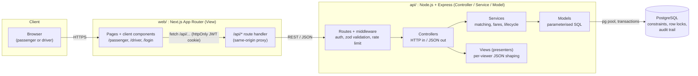
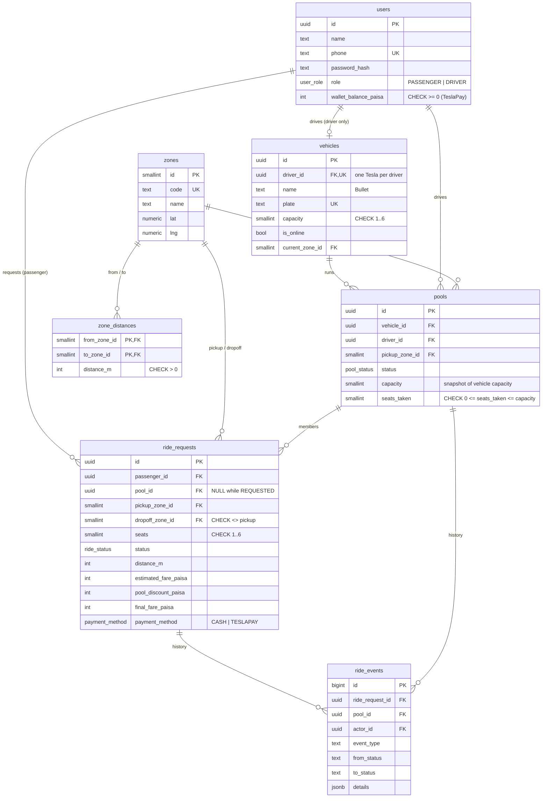
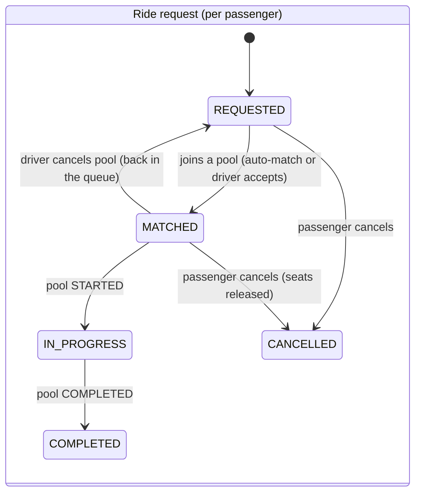
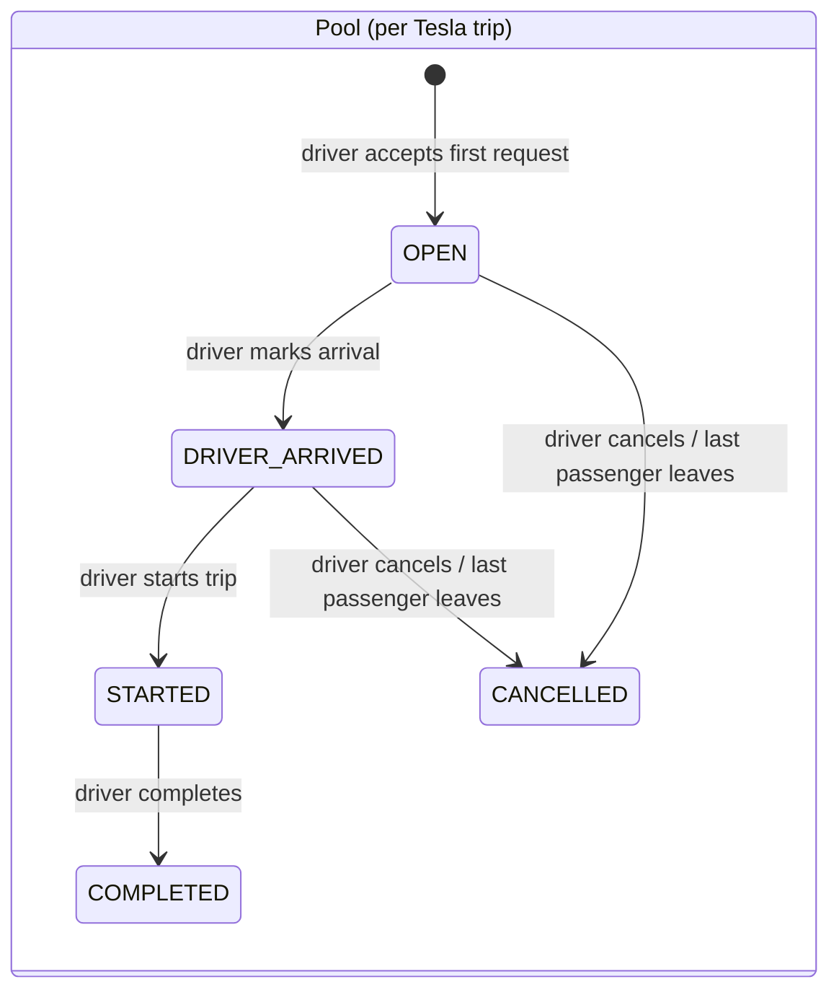

# Architecture

This document was written before the code, and it is updated whenever the implementation
changes. Everything here uses the story cast. Jashim drives **Bullet** (3 seats).
**Nusrat**, **Rafiq** and **Shirin** are passengers.

## 1. System overview



- **One API process and one database.** There are no queues, caches or microservices. At
  MVP scale, matching is one indexed query and seat claiming is one transaction. Anything
  more would be complexity we can't justify yet (see [scaling.md](scaling.md) for when
  that changes).
- **Same-origin proxy.** The browser only talks to the Next.js origin. A catch-all route
  handler (`web/src/app/api/[...path]/route.ts`) forwards `/api/*` to the Express API, so
  the auth cookie is first-party, `httpOnly` and `SameSite=Lax`. There's no CORS dance and
  no token in `localStorage`.
  - *Changed during implementation:* the first design used `next.config` rewrites, but
    those are resolved at **build time** and would bake the API URL into the Docker image.
    The route handler reads `API_URL` per request.
- **Polling, not WebSockets.** Screens refresh ride/pool state every 3 seconds. Rides
  change state on a scale of minutes, so a 3-second delay is fine, and polling survives
  free-tier hosts that sleep and drop sockets.

## 2. MVC layering inside the API

| Layer | Folder | Responsibility | Must NOT |
|---|---|---|---|
| Routes | `api/src/routes` | URL → middleware chain → controller | contain logic |
| Controllers | `api/src/controllers` | parse and validate input (zod), call one service, pick status code, render a view | touch SQL |
| Services | `api/src/services` | business rules: matching, fare, state transitions, transactions | know about `req`/`res` |
| Models | `api/src/models` | parameterised SQL for one table/aggregate | make business decisions |
| Views | `api/src/views` | turn rows into JSON for a *specific viewer* (a passenger never sees another passenger's fare) | query the DB |
| Domain | `api/src/domain` | pure functions: fare formula, state machine, compatibility rule | do I/O (so they're unit-testable) |

The **web app is the View layer for humans**. `api/src/views` is the View layer for the JSON
contract.

## 3. Data model (ERD)



### Why each table exists

- **users**: one table for both roles. A role enum is enough because a person is either a
  passenger or a driver in this MVP. `wallet_balance_paisa` is the simulated TeslaPay wallet.
- **vehicles**: capacity belongs to the Tesla, not the driver. `driver_id` is UNIQUE (one
  Tesla per driver). Online status and current zone live here because matching asks
  *"which Teslas are available in Banani?"*.
- **zones / zone_distances**: our "map". The distances are a fixed table (straight-line
  distance × 1.3 road factor, rounded to 100 m), so fares can be checked by hand. Later we
  could swap in real road distances without changing any other table.
- **pools**: one Tesla trip. Several ride requests can point at one pool. `capacity` is
  **snapshotted** from the vehicle so that editing Bullet later can't retroactively
  overbook a running trip. `seats_taken` is a denormalised counter, guarded by
  `CHECK (seats_taken <= capacity)`. It's the row we lock for seat allocation.
- **ride_requests**: one passenger's trip: route, seats, their own fare and their own
  status. Pool membership is `pool_id`.
- **ride_events**: append-only audit trail (who changed what, from which status to which,
  when). This is how we "explain exactly what happened, in case anyone asks later".

### Integrity rules enforced by the database (not just the code)

| Rule | Constraint |
|---|---|
| Bullet never carries more than 3 | `pools.seats_taken <= capacity` CHECK |
| A passenger has at most one active ride | partial UNIQUE index on `ride_requests(passenger_id) WHERE status IN (REQUESTED, MATCHED, IN_PROGRESS)` |
| A Tesla runs at most one active pool | partial UNIQUE index on `pools(vehicle_id) WHERE status IN (OPEN, DRIVER_ARRIVED, STARTED)` |
| Matched/in-progress/completed rides belong to a pool | CHECK on `(status, pool_id)` |
| Money is never fractional or negative | `integer` paisa columns with `CHECK >= 0` |
| Pickup ≠ dropoff | CHECK |

## 4. Lifecycles

The suggested single lifecycle was split into **two**: one for the **passenger's
request** and one for the **Tesla's pool**. A pool has several passengers. Rafiq cancelling
must not cancel Nusrat's trip, and "driver arrived" is a fact about the Tesla, not about
one passenger.





- New passengers can join while the pool is `OPEN` or `DRIVER_ARRIVED` (Jashim is waiting
  at Banani). Once it's `STARTED`, the doors are closed.
- A passenger can cancel only before the pool starts. After that they're in the car.
- Every transition goes through one table (`api/src/domain/stateMachine.ts`). Anything
  else is rejected with `409 INVALID_TRANSITION`.

## 5. Matching rule

A new request (pickup `P`, dropoff `D`, `s` seats) can join pool `X` when **all** of these
hold:

1. `X.pickup_zone = P`: same pickup zone. Everyone gets picked up at the same corner.
2. `X.status ∈ {OPEN, DRIVER_ARRIVED}`
3. `X.capacity − X.seats_taken ≥ s`
4. For every passenger already in `X`, `distance(D, their dropoff) ≤ 3 000 m`. Their
   destinations are close to each other, so the drop-off detour stays short.

Nusrat and Rafiq: both pick up in **Banani**. Mohakhali ↔ Gulshan 1 is **1.5 km**, which
is ≤ 3 km, so they're **compatible**. If Shirin requests Banani → Uttara, Uttara is
14.5 km from Mohakhali, so she's **not compatible** and waits for another Tesla.

Matching happens in two places, and both use the same function:

- **Auto-match**: when a passenger requests, we try to join an existing compatible pool
  (the oldest first).
- **Driver accept**: a driver sees `REQUESTED` rides in their zone. If they already have a
  pool, they only see rides that are compatible with it.

## 6. Fare model

All money is stored as **integer paisa** (৳1 = 100 paisa). JavaScript numbers are floats
(`0.1 + 0.2 !== 0.3`), and a fare that is off by a fraction of a paisa is a support
ticket. Integers make every calculation exact and reproducible by hand.

```
subtotal      = (BASE_FARE + round(distance_m × PER_KM / 1000)) × seats
poolDiscount  = floor(subtotal × 20 / 100)   only if ≥ 2 ride requests shared the trip
fare          = subtotal − poolDiscount

BASE_FARE = 3 000 paisa (৳30)   PER_KM = 1 500 paisa (৳15 / km)
```

- The **estimate** shown at request time is the solo price, which is the maximum. The
  **final fare** is locked when the trip completes. A passenger never pays more than the
  quote. They pay less if they actually shared.
- "Shared" means at least one *other ride request* was in the car when the trip started.
  Nusrat booking 2 seats for herself and a friend is not pooling.

**Worked example: Nusrat and Rafiq share Bullet from Banani**

| | Nusrat → Mohakhali | Rafiq → Gulshan 1 |
|---|---|---|
| distance | 2 300 m | 2 500 m |
| distance charge | 2 300 × 1 500 / 1000 = 3 450 | 2 500 × 1 500 / 1000 = 3 750 |
| subtotal (1 seat) | 3 000 + 3 450 = **6 450** | 3 000 + 3 750 = **6 750** |
| pool discount 20% | 1 290 | 1 350 |
| **final fare** | **5 160 paisa = ৳51.60** | **5 400 paisa = ৳54.00** |

Payment is **Cash** or a simulated **TeslaPay** wallet. A TeslaPay request needs a wallet
balance of at least the estimate. The final fare is debited in the same transaction that
completes the trip.

## 7. Concurrency: the last seat

Scenario: Bullet has 1 seat left. Nusrat and Shirin both request at the same instant, and
both *read* "1 seat available".

What the code does (`api/src/services/pool.service.ts`):

1. Inside one transaction, the pool row is locked with `SELECT … FOR UPDATE`. The second
   transaction **waits** until the first commits, then re-reads `seats_taken` and finds
   that there are 0 seats. The capacity and compatibility checks run *under the lock*.
2. The seat claim itself is a conditional update:
   `UPDATE pools SET seats_taken = seats_taken + $s WHERE id = $id AND status IN (...) AND seats_taken + $s <= capacity`.
   If zero rows are updated, the claim is refused, even if a code path forgot to lock.
3. `CHECK (seats_taken <= capacity)` is the last line of defence. If the first two layers
   were ever bypassed (a manual SQL fix, a future bug), the database refuses the write.

The loser isn't given an error. Their request stays `REQUESTED` and they get the message
"the last seat was just taken, looking for another Tesla". This is covered by an
automated test that fires both requests with `Promise.all`.

**Lock ordering.** Every transaction that touches both a pool and its ride requests locks
the **pool first**. That prevents deadlocks between, for example, "Jashim starts the
trip" and "Rafiq cancels". Transactions that fail with a serialization or deadlock error
(`40001` / `40P01`) are retried up to 3 times.

**At larger scale** (see [scaling.md](scaling.md)): the row-lock approach holds while one
Postgres primary can absorb the write rate. Past that, we'd partition matching by zone
(one matcher per zone or geohash cell, fed by a queue) so that contention on a pool never
crosses a shard. We'd also use idempotency keys on requests so client retries are safe.

## 8. Authentication and authorisation

- Passwords are hashed with bcrypt (cost 10). Login issues a JWT (`sub`, `role`, 7-day
  expiry) in an `httpOnly`, `SameSite=Lax` cookie (`Secure` in production).
- `requireAuth` verifies the token. `requireRole('DRIVER')` guards driver routes.
- **Ownership is checked in the query**, e.g. `WHERE id = $1 AND passenger_id = $2`. If
  Rafiq asks for Nusrat's ride, he gets `404`, not `403`, so ride IDs can't be probed.
- Sign-up creates passengers only. Drivers (and their Teslas) are onboarded by the
  operator, which is represented by the seed data, because in reality that needs
  document and vehicle checks.

## 9. Error model

Every error response has the same shape:

```json
{ "error": { "code": "SEAT_UNAVAILABLE", "message": "Bullet is full", "details": {} } }
```

| Status | When |
|---|---|
| 400 `VALIDATION_ERROR` | zod rejected the body/params |
| 401 `UNAUTHENTICATED` | no or invalid session |
| 403 `FORBIDDEN` | wrong role |
| 404 `NOT_FOUND` | doesn't exist *or isn't yours* |
| 409 `INVALID_TRANSITION`, `ACTIVE_RIDE_EXISTS`, `SEAT_UNAVAILABLE`, … | business rule conflict |
| 429 | rate limited (auth endpoints) |
| 500 `INTERNAL` | logged with request id, generic message to client |
