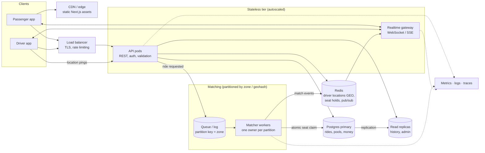

# If Oi Tesla Goes Viral: 1M passengers, 100k drivers

The MVP is one API process, one Postgres, and polling. That is the right size for now.
This document reasons about what breaks first as load grows, and what we would change *at
that point*. None of it is built. Building it now would be the over-engineering the brief
warns against.

## Rough numbers first

| Assumption | Value |
|---|---|
| Registered passengers / drivers | 1,000,000 / 100,000 |
| Peak concurrent online drivers | ~30,000 (Dhaka rush hour) |
| Peak ride requests | ~1M rides/day with 25% in the two rush hours: ~35 requests/s average, **~150/s peak** |
| Driver location / status updates | 30k drivers × 1 update / 5 s = **~6,000 writes/s** |
| Passenger status polling today (3 s) | ~100k active riders ÷ 3 s = **~33,000 reads/s** |

What these numbers say:

- **Ride creation and seat allocation are not the problem.** 150 transactions/s is easy
  for one Postgres primary.
- **Polling and location updates are the problem.** 33k polling reads/s and 6k location
  writes/s are what saturate the MVP design first.
- **Contention is local.** It happens inside one pickup zone (Banani at 8:41 AM), never
  across the whole city.

## Target architecture

## Concern by concern

**Load balancing and horizontal scaling.** The API is already stateless: JWT sessions,
and nothing held in memory between requests. It can run as N identical pods behind a load
balancer and autoscale on CPU and request latency. The Next.js tier scales the same way,
with static assets on a CDN.

**Real-time instead of polling.** The first thing to change. Move to Server-Sent Events or
WebSockets through a dedicated gateway, fanned out with Redis pub/sub or NATS. Clients
subscribe to their own ride and pool channel, and the server pushes each state change once.
33k reads/s becomes a few hundred pushes/s. Keep polling as the fallback (it's already
written) for flaky mobile networks.

**Geospatial search.** Replace fixed zones with real coordinates:
- Driver locations go into Redis `GEO` (or PostGIS / H3 cells) with a TTL. They're
  ephemeral: we never write each location ping to Postgres.
- "Teslas near Nusrat" becomes a radius or H3-ring query.
- The compatibility rule stops being "dropoffs within 3 km" and becomes a real detour
  check using a routing engine (OSRM self-hosted), cached per H3-cell pair.

**Ride matching and database contention.** Today, seat allocation is protected by a row
lock on the pool plus a conditional UPDATE. Contention only happens *within one pool*, so
it scales with the number of pools, not users. At viral scale:
- Put ride requests on a queue **partitioned by pickup zone / geohash** (Kafka, Redpanda,
  or SQS FIFO with a message group per zone).
- Each partition has exactly one matcher worker. Matching within Banani is then
  *sequential by construction*: no two workers ever race for Bullet's last seat, and
  database locks become a safety net rather than the hot path.
- Batch matching (collect requests for about 2 s, then solve assignment) also gives better
  pools than first-come-first-served.
- Postgres constraints (`seats_taken <= capacity`, one active ride per passenger) stay as
  the final guard. They cost almost nothing and have already caught bugs in testing.

**Database scaling.**
- Keep money and state on one primary: rides, pools and wallets need strong consistency.
- Send history screens, driver earnings and analytics to **read replicas**.
- Partition `ride_events` and old `ride_requests` by month (native Postgres partitioning)
  and archive to object storage.
- Add a pgBouncer connection pooler in front of the primary.
- Shard by city (Dhaka / Chattogram / Sylhet) only when one city outgrows one primary.
  Rides never cross cities, so this is a clean shard key.
- The indexes that already exist (partial indexes on active statuses) keep the hot set
  small. Most rows are completed rides, and those never appear in matching queries.

**Caching.** Zones, fares config and vehicle profiles are read-mostly, so cache them in
process or in Redis. Do **not** cache seat availability for decisions. It can be cached for
*display* ("~1 seat left"), but the claim always goes to the source of truth.

**Idempotency.** Mobile clients retry. `POST /rides` and every driver action take an
`Idempotency-Key` header, stored with a unique index on `(user_id, key)` and the stored
response replayed on retry. Today the one-active-ride unique index and the guarded state
transitions already make double-taps harmless. Explicit keys make it formal.

**Rate limiting.** Today it's per IP on the auth endpoints, in memory. At scale:
- Keep the counters in Redis so all pods share them.
- Rate-limit per user and per endpoint: ride creation is expensive, status reads are cheap.
- Add stricter limits for sign-up and OTP flows, and bot protection at the edge.

**Retries and failure strategy.**
- Transactions already retry on deadlock or serialization failure (3 attempts). Extend
  that with exponential backoff and jitter.
- Use a **transactional outbox**: write state change and event in one DB transaction, and
  a relay publishes to the queue. We never lose or double-publish a "matched" notification
  if a pod dies mid-request.
- Matcher workers are idempotent (they re-check `status = 'REQUESTED'` under lock), so
  redelivered messages are harmless.
- Degrade gracefully: if matching is slow, requests stay `REQUESTED` and the passenger sees
  "looking for a Tesla" rather than an error.

**Observability.**
- Structured JSON logs with request ids are already in place. Ship them to Loki or
  OpenSearch.
- Add OpenTelemetry traces across API → queue → matcher → DB.
- Track the key SLOs: time-to-match p95, seat-claim conflict rate, request error rate,
  DB lock wait time, and queue lag per zone.
- Alert on a queue-lag spike in one zone. That is the "Banani is jammed" signal.

**Security.**
- Short-lived access tokens plus refresh token rotation, and revocation on logout.
- Phone OTP instead of passwords for passengers.
- Secrets in a secret manager, not environment files.
- WAF at the edge, per-user authorisation checks kept in the query layer (as today), PII
  minimisation (co-riders see first names only, which is already done), and audit logs for
  wallet changes.

**Deployment strategy.**
- Containers (the same Dockerfiles) on a managed orchestrator (ECS, Cloud Run, or
  Kubernetes once there's a platform team).
- Blue/green or canary rollouts gated by SLOs.
- Migrations follow expand → migrate → contract, so old and new pods can run side by side.
  The migration runner's advisory lock already prevents two pods migrating at once.
- Feature flags for matching-algorithm changes, rolled out zone by zone.

## Order of changes as load actually grows

1. Polling → push (SSE), plus Redis for shared rate limits. *First bottleneck: reads.*
2. Read replicas for history, and pgBouncer. *Second: connections.*
3. Real coordinates in Redis GEO / H3, and live driver locations. *Product need as much as
   scale.*
4. Zone-partitioned queue and matcher workers, and the outbox. *When a single zone's
   matching becomes contended or slow.*
5. City sharding. *Only when one city outgrows one primary.*
